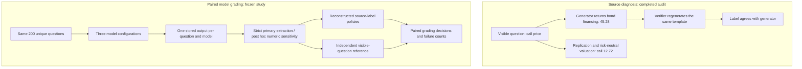

## Executive summary (read this first)

Lead with the wrong financial quantity: the released binomial-call label matches
bond financing, and the inspected verifier repeats the generator's calculation.
Then ask whether changing the numerical reference changes grades on identical
model outputs. The contribution is external released-supervision evidence with a
paired grading measurement. Precision validation, label repair and answer
determinacy already have direct prior art.

This first-page draft uses completed audit findings and the frozen three-model
design. It claims no model result while inference runs. It does not edit the
manuscript. Replace the prospective study sentence only after all planned attempts
are accounted for and the saved outputs are independently rescored.

The supplementary numeric extractor was added after unit-format failures were
observed. Its results must be described as exploratory and post hoc. The frozen
strict primary result remains alongside it. Full-panel results remain unavailable;
the completed DeepSeek slice is assessed in the
[first-page review](MODEL_GRADING_FIRST_PAGE_REVIEW.md).

## Suggested abstract while model inference is incomplete

Agreement with a generator can verify the wrong financial quantity. In a released
one-period option question, a label of 45.28 is the bond-financing amount; replication
and risk-neutral valuation give a call price of 12.72. The inspected public verifier
regenerates the same template, allowing the shared computation error to pass. We
audit 12,655 selected rows from two public synthetic financial-supervision releases.
In Cosimo, 975 of 1,000 binomial-call labels fail independent valuation identities,
and 946 of 1,000 constructed-response Gordon labels violate a whole-unit instruction.
Seven comparison families match their numerical labels. Separate hidden-precision
findings remain conditional on interpreting displayed inputs as rounded. To measure
grading consequences, we freeze 200 distinct questions across two defective and two
passing families for three model configurations, then compare identical stored
answers under reconstructed source-label policies and independent visible-question
formulas. We retain the strict-format primary analysis and add an explicitly post
hoc numeric-final-line sensitivity after observing unit-format failures. We
provide pinned source evidence, separately checked calculations and
numerical patches. The study concerns released supervision and numerical evaluation;
it does not measure training harm or introduce a general verification method.

This is a result-safe interim abstract, not the final model-results abstract. In the
final version, replace the sentence beginning “To measure grading consequences”
with actual completed-output counts and the strongest paired effect. Keep the
family, denominator, policy and model configuration attached to that effect.
Do not assert a ranking reversal before observing it. If that strongest effect
comes from recovered numeric answers, explicitly label it exploratory and include
the strict result or its format-failure limitation nearby.

## Suggested introduction prose

A public synthetic finance question asks for the price of a one-period call with
stock price 58, up and down multipliers 1.15 and 0.85, strike 48, and risk-free return
6%. Its released label is 45.28. Both portfolio replication and discounted
risk-neutral expected payoff give 12.72. The difference has a specific source:
the inspected generator returns the positive bond-financing amount rather than
subtracting it from the stock position to obtain the call price. The public
verification harness regenerates the selected template and compares its answer.
Repeating that computation can establish reproducibility while preserving its
mistake. The financial identity tests whether the computed quantity answers the
question. [Public generator and verifier](https://github.com/btech-software/cosimo/tree/20668622104bf8237837efd67debd1419f7bbe33/dataset),
[Cox, Ross and Rubinstein, Section 3](https://bpb-us-w2.wpmucdn.com/u.osu.edu/dist/7/36891/files/2017/07/CRR79-1yy8av8.pdf).

This distinction matters when released answers and chosen completions are used as
supervision or numerical evaluation references. A model can produce a financially
correct answer yet disagree with a source label; an incorrect answer can instead
receive credit. These are properties of a grading decision, separate from whether
the model learned the generator's error. Our question is therefore bounded:
which released labels disagree with their visible financial questions, why do
they disagree, and how do explicit grading policies treat the same observed
model answer?

We audit 12,655 rows from selected families of two pinned public releases. The
binomial error affects 975 of 1,000 rows and reproduces a specific wrong quantity.
Another 946 of 1,000 constructed-response Gordon labels retain cents when the
question requests a whole-unit answer. Seven comparison families agree with their
labels, providing checks against a universal parsing failure. Hidden-precision
findings in DCF and CAPM require a different interpretation: their labels remain
feasible if displayed inputs are treated as rounded. We distinguish these cases
from unconditional financial-computation errors.
[Executed family census](../outputs/answer-contract-v1/results.json),
[independent rational-arithmetic check](ANSWER_CONTRACT_INDEPENDENT_VALIDATION.md).

We then freeze a paired grading study of 200 distinct questions: 50 each from
constructed Gordon, binomial calls, ordinary Gordon and WACC. Three configurations
receive the same untouched questions and common final-answer instructions:
Qwen3-1.7B, Qwen2.5-Coder-3B-Instruct and a provider-pinned DeepSeek V3.2 endpoint.
Each stored response will be evaluated against both source labels under declared
sensitivity policies and independently derived visible-input answers. The
ordinary Gordon and WACC families supply passing-label comparisons. This design
measures disagreement between graders on fixed outputs; it does not estimate a
causal effect of the dataset on training or isolate model size.
[Frozen protocol](MODEL_GRADING_PROTOCOL_V1.md).

The common answer-format instruction introduces an additional measurement choice.
Strict extraction rejects missing or placeholder units even when a final scalar
is stated. Such failures do not establish a financial error and can prevent any
numerical grader disagreement from being measured. We preserve that frozen primary
analysis and introduce an explicitly post hoc sensitivity limited to the last
final-answer line. It changes extraction, retains the outputs and numerical
policies, and does not certify full response compliance. Both analyses retain
unsuccessful attempts in the panel denominator.
[Numeric sensitivity amendment](MODEL_GRADING_AMENDMENT_NUMERIC.md).

Financial label repair and precision validation are established practices.
FinanceReasoning revises ambiguous questions and erroneous targets; FinChain
checks units, precision and displayed-versus-hidden operands; FinVerBench measures
observability and rendering effects on model performance. Our contribution is
external evidence about these released training and preference sources: a
source-attributed wrong-quantity error surviving generator-coupled verification,
independent financial checks, and a paired measurement of numerical grading
consequences. For Gordon rounding, a simple integer constraint with a half-unit
source-label allowance is already sufficient on tested controls. A new general
checker is unnecessary to establish the finding.
[FinanceReasoning, Section 2.1](https://aclanthology.org/2025.acl-long.766.pdf),
[FinChain, Section 3.2 and Appendix A.3](https://aclanthology.org/2026.acl-long.662.pdf),
[FinVerBench, Sections 3.5 and 6.5](https://arxiv.org/html/2605.29586v1).

## First-page diagram layout

Use a compact two-row figure. The first row shows the diagnosed source mechanism;
the second shows how observed consequences will be measured. Avoid mixing derived
audit targets with observed model responses.

Suggested caption: “The audited generator and verifier can agree on the wrong
financial quantity. The grading extension holds each model output fixed and
compares reference-relative credit under declared source-label policies. The
strict primary extraction is retained alongside an exploratory numeric sensitivity.
The 45.28 and 12.72 values are an audited example, not a model response.”

In the actual paper figure, use one shared visible-question box for the diagnosis,
put the independently justified quantity beside the generator label, and give the
model-grading row fewer words. Use arrows for computational dependencies. A
verification badge denotes agreement with the inspected generator, not an
independently verified financial answer. Do not plot speculative model counts.

## Three-model reporting and exact claim boundary

The frozen selection SHA256 is
`75c5b694db2d9a174e089c594e3f756867e0f840f12ac4634e5dc20173acf0cc`;
the full settings and model revisions are in the
[selection manifest](../outputs/model-grading-v1/selection_manifest.json).
The planned panel contains 600 model/question attempts, not 600 independent
financial situations. The source families are purposively selected, followed by
fixed salted-hash selection of unique prompts within each family.

The supplementary endpoint was frozen at 18:29:11 UTC after 63 DeepSeek and
60 Qwen3 records existed, with no Coder study output. The
[freeze record](../outputs/model-grading-v1/numeric_sensitivity_freeze.json) preserves
counts and snapshot hashes. This timing does not make results on later-collected
responses a preregistered numerical endpoint. State that extraction was amended
after output-format inspection, without suggesting that the original study was
refrozen or that answers were regenerated.

Describe the models as heterogeneous configurations. The
[Qwen2.5-Coder model card](https://huggingface.co/Qwen/Qwen2.5-Coder-3B-Instruct)
establishes code specialization; it is not a size-matched general-purpose control.
The [Qwen3 model card](https://huggingface.co/Qwen/Qwen3-1.7B) documents its
nonthinking switch. The
[DeepSeek serving catalogue](https://openrouter.ai/deepseek/deepseek-v3.2)
supports the provider description, but a dated catalogue identifier cannot prove
immutable API weights. Local pinned file hashes offer a different reproducibility
guarantee from provider/model metadata.

Make per-family paired counts primary. Report parsed-completed counts and all
formatting, truncation and infrastructure failures. State whether a score uses all
200 attempts or only parsed-completed answers. The equal-weight four-family
aggregate is a score on this frozen panel. It is not a score on the complete source
release. A source-policy false acceptance is defined relative to the independent
numerical reference; it does not certify or reject an entire reasoning trace.

Binomial reference agreement is conditional on interpreting the quoted risk-free
rate as an effective one-period return, with gross return `1 + r`. One completed
DeepSeek answer instead uses continuous compounding and returns 3.06 versus the
frozen `64/21` reference. The question does not explicitly specify compounding.
Preserve frozen counts and report a convention mismatch, not an unequivocal
reasoning error. The source bond-as-call error persists in that case under either
convention.

The convention sensitivity's first freeze followed 64 Coder answers, including
14 binomial answers, and preceded every 4B financial answer. Its earlier planning
claim about Coder timing was incorrect; the
[timing correction](MODEL_GRADING_CONVENTION_TIMING_CORRECTION.md) preserves the
record and corrects the assessment. This is distinct from the 18:29 extraction
amendment, which did precede all Coder study responses.

For the sensitivity, report recovered values by explicit, absent and placeholder
units. Missing units are inferred from the question type for this diagnostic;
they do not demonstrate full unit compliance. Report strict-only failures,
additional numeric recoveries and their paired grade changes. Both endpoints
remain dependent on the final marker and finish condition; failed extraction is
not a numerical error diagnosis. A post hoc recovery result should not silently
replace the primary result in the abstract or results table.

The integer-plus-source-half-unit baseline applies to constructed Gordon only.
Mark it not applicable for other families and avoid a mixed-family aggregate for
that policy. Source-label comparators are reconstructed sensitivity policies, not
executions of an upstream deployed reward system. The public code pin is separate
from the dataset pin; attribution shows the mechanism without proving that the
inspected commit generated the exact release.

If all model outputs are poor or graders agree, state that result. The deterministic
source diagnosis remains established; observed evaluation distortion would then
be limited or absent in this panel. If differences appear, report their actual
magnitude and configurations. No human financial-expert review or professor
endorsement is established by the course-informed review.
